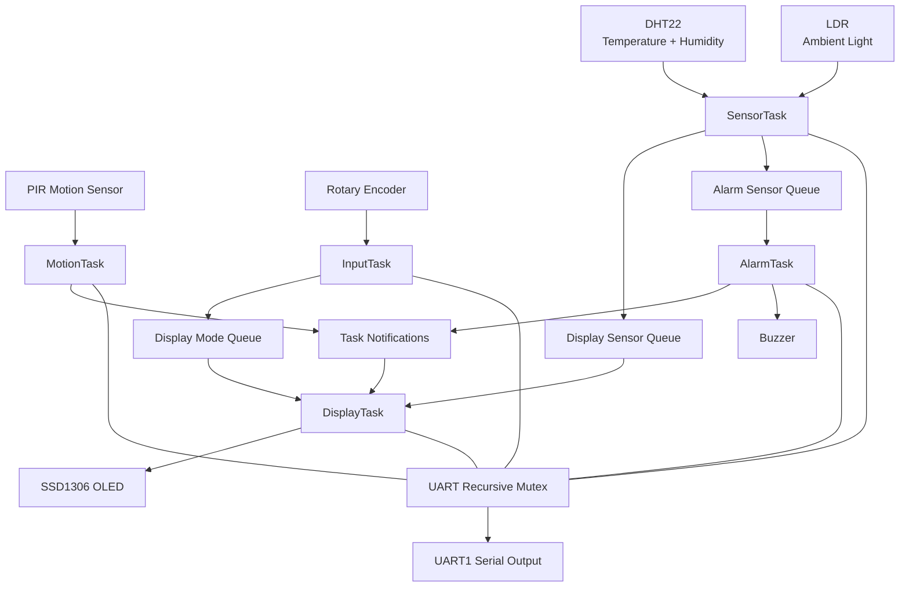
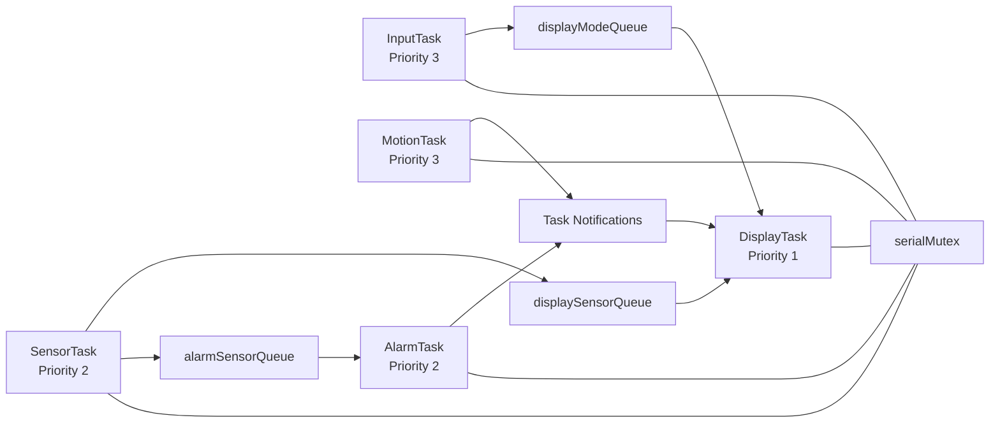
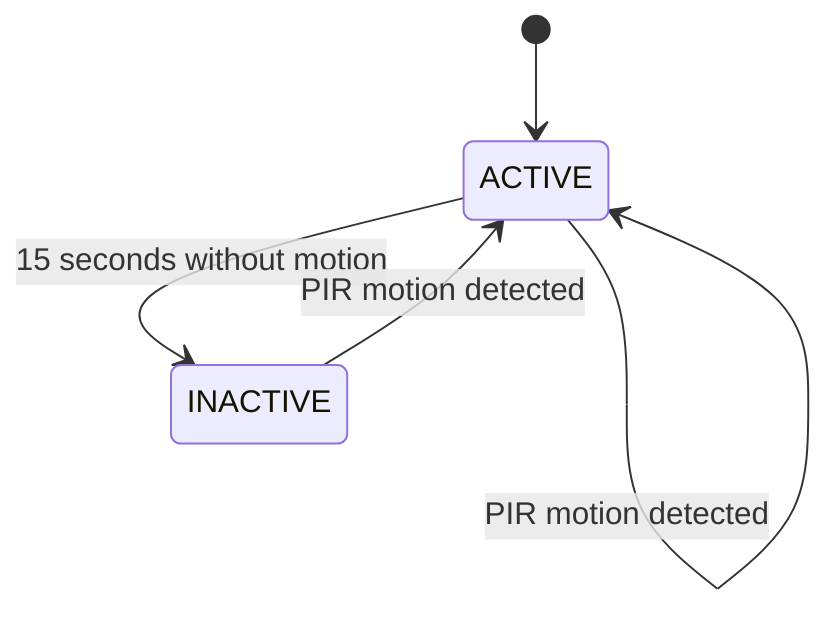

# BCA182 FreeRTOS Multisensor Room Monitoring System

## Project Overview

This project is my implementation of a real-time room monitoring system using an **STM32F103C8T6 Blue Pill** and **FreeRTOS**.

The system monitors temperature, humidity, ambient light, and motion. Sensor information is shown on an SSD1306 OLED display, while a rotary encoder is used to move between display pages. A buzzer is activated when the temperature goes outside the allowed range.

I also implemented an ACTIVE/INACTIVE state system. When no motion is detected for 15 seconds, the system becomes INACTIVE and the OLED is blanked. Once PIR motion is detected again, the system returns to ACTIVE mode.

The project was developed using:

- PlatformIO
- STM32Cube HAL
- FreeRTOS
- Wokwi
- Unity
- Cppcheck
- Git and GitHub

---

## Features

The final system includes:

- DHT22 temperature and humidity monitoring
- LDR ambient-light monitoring
- SSD1306 OLED display
- Four display pages
- Rotary encoder navigation
- High- and low-temperature alarm detection
- PWM buzzer output
- PIR motion sensing
- ACTIVE and INACTIVE operating states
- Automatic OLED blanking during inactivity
- FreeRTOS multitasking
- Queue-based sensor communication
- FreeRTOS task notifications
- UART protection using a recursive mutex
- Native unit testing
- Static code analysis
- Wokwi functional verification
- Deliberate FreeRTOS fault experiments

---

## Learning Objectives

Through this laboratory project, I practiced how to design a small embedded system using real-time operating-system concepts instead of placing all program logic inside one continuous loop.

The project helped me apply:

- FreeRTOS task creation
- task priorities
- periodic execution
- Ready, Running, and Blocked task states
- `vTaskDelay()` and `vTaskDelayUntil()`
- queues
- mutexes
- task notifications
- interrupt-driven input
- state-machine logic
- modular C++ design
- unit testing
- static code analysis
- simulation-based verification
- incremental Git development

---

## System Architecture

The project is divided into sensing, user input, display, alarm, motion/state handling, and shared RTOS communication objects.



**Figure 1 — System architecture.**  
The diagram shows how the sensors, FreeRTOS tasks, queues, task notifications, shared UART resource, OLED, and buzzer are connected.

---

## FreeRTOS Architecture
### Task Design

The final firmware uses five main FreeRTOS tasks.

| Task | Priority | Main Responsibility | Typical Blocking Behavior |
|---|---:|---|---|
| `SensorTask` | 2 | Reads temperature, humidity, light, and the latest motion status | `vTaskDelayUntil()` |
| `DisplayTask` | 1 | Owns the OLED and displays the selected sensor page | Waits for queue data / notifications |
| `InputTask` | 3 | Processes rotary encoder movement and button input | `vTaskDelay()` |
| `AlarmTask` | 2 | Evaluates temperature and controls the buzzer | Waits for sensor data |
| `MotionTask` | 3 | Reads the PIR sensor and manages ACTIVE/INACTIVE state | `vTaskDelayUntil()` |

### Priority Design

`InputTask` and `MotionTask` use priority 3 because user input and motion changes should be handled quickly.

`SensorTask` and `AlarmTask` use priority 2 because sensor acquisition and alarm processing are important but do not require the same immediate response as input events.

`DisplayTask` uses priority 1 because updating the OLED is less time-critical than sensing, motion detection, or alarm processing.

One important design rule in this project is that the higher-priority tasks still block regularly. This prevents them from starving the lower-priority tasks.

---

## FreeRTOS Task Communication



**Figure 2 — FreeRTOS task communication.**  
The sensor readings are distributed using queues, display modes are passed from `InputTask`, and state/alarm events are delivered to `DisplayTask` using task notifications.

---

## Hardware / Simulated Components

| Component | Purpose |
|---|---|
| STM32F103C8T6 Blue Pill | Main microcontroller |
| DHT22 | Temperature and humidity sensing |
| Photoresistor / LDR | Relative ambient-light sensing |
| SSD1306 OLED | Display output |
| Rotary Encoder | User navigation |
| PIR Sensor | Motion detection |
| Buzzer | Temperature alarm |
| UART1 | Runtime logging and debugging |

---

## Pin Configuration

| Device / Signal | STM32 Pin |
|---|---|
| DHT22 Data | PB0 |
| LDR ADC | PA0 |
| OLED SCL | PB6 |
| OLED SDA | PB7 |
| Encoder CLK | PA1 |
| Encoder DT | PA2 |
| Encoder SW | PA3 |
| Buzzer PWM | PA8 |
| PIR OUT | PB1 |
| UART1 TX | PA9 |
| UART1 RX | PA10 |

The SSD1306 OLED uses I2C1 at address:

```text
0x3C
```

---

## Inter-Task Communication

### Sensor Data Queues

`SensorTask` collects the latest readings using the following structure:

```cpp
struct SensorData
{
    float temperature;
    float humidity;
    int lightLevel;
    bool motionDetected;
};
```

The sensor data is distributed through:

```text
displaySensorQueue
alarmSensorQueue
```

Both queues use `xQueueOverwrite()` because only the newest sensor reading is needed.

### Display Mode Queue

The currently selected OLED page is sent from `InputTask` to `DisplayTask` through:

```text
displayModeQueue
```

The available pages are:

```text
TEMPERATURE
HUMIDITY
LIGHT
MOTION
```

Clockwise rotation moves to the next page, while counterclockwise rotation moves to the previous page.

### Task Notifications

Task notifications are used for lightweight event signaling.

The events include:

```text
ACTIVE
INACTIVE
MOTION
ALARM
```

These notifications allow `MotionTask` and `AlarmTask` to inform `DisplayTask` when an important event occurs.

### UART Mutex

Several FreeRTOS tasks use UART1 for diagnostic messages.

To avoid simultaneous UART access, the project uses a recursive mutex:

```text
serialMutex
```

The mutex ensures that one task completes its UART operation before another task uses the same shared resource.

---

## State Machine

The room-monitoring system has two operating states:

```text
ACTIVE
INACTIVE
```



**Figure 3 — System state machine.**  
The system begins in ACTIVE mode. Fifteen seconds without motion causes a transition to INACTIVE. PIR motion returns the system to ACTIVE.

### ACTIVE

While the system is ACTIVE:

- sensor readings continue
- OLED information is visible
- rotary encoder navigation is accepted
- alarm monitoring remains active

### INACTIVE

While the system is INACTIVE:

- OLED is blanked
- rotary encoder input is ignored
- sensor readings continue
- alarm monitoring continues
- PIR motion can reactivate the system

---

## Temperature Alarm

The alarm logic uses the following temperature limits:

| Temperature | Result |
|---|---|
| Below 18 °C | LOW temperature alarm |
| 18 °C to 30 °C | NORMAL |
| Above 30 °C | HIGH temperature alarm |

The exact boundary values:

```text
18.0 °C
30.0 °C
```

are both treated as NORMAL.

When a high- or low-temperature condition is detected, the buzzer is activated.

---

## Repository Structure

The project was separated into multiple modules so that `main.cpp` stays focused mainly on initialization, RTOS object creation, task creation, and scheduler startup.

```text
project/
│
├── include/
│   ├── alarm.h
│   ├── alarm_task.h
│   ├── app_config.h
│   ├── app_types.h
│   ├── display.h
│   ├── display_logic.h
│   ├── dht22.h
│   ├── input.h
│   ├── logging.h
│   ├── motion.h
│   ├── rtos_objects.h
│   ├── sensors.h
│   ├── ssd1306.h
│   └── system_state.h
│
├── src/
│   ├── alarm.cpp
│   ├── alarm_task.cpp
│   ├── display.cpp
│   ├── display_logic.cpp
│   ├── dht22.cpp
│   ├── input.cpp
│   ├── logging.cpp
│   ├── main.cpp
│   ├── motion.cpp
│   ├── rtos_objects.cpp
│   ├── sensors.cpp
│   ├── ssd1306.cpp
│   └── system_state.cpp
│
├── test/
│   └── test_logic/
│       └── test_main.cpp
│
├── docs/
│   ├── functional-verification.md
│   └── fault-experiments.md
│
├── lib/
│   └── FreeRTOS/
│
├── diagram.json
├── platformio.ini
├── wokwi.toml
└── README.md
```

---

## Getting Started

### Requirements

The project can be opened and built using:

- Visual Studio Code
- PlatformIO
- Git
- Wokwi Simulator extension

Clone the repository or open the existing project directory in Visual Studio Code.

---

## Building the Project

Build the STM32 firmware using:

```powershell
pio run -e bluepill_f103c8
```

The generated ELF file is used by Wokwi to run the STM32 simulation.

---

## Running the Wokwi Simulation

Before starting Wokwi, build the STM32 environment:

```powershell
pio run -e bluepill_f103c8
```

Then start the Wokwi Simulator from Visual Studio Code.

During simulation, I can interact with the system by:

1. changing the DHT22 temperature and humidity
2. changing the photoresistor illumination
3. rotating the encoder clockwise or counterclockwise
4. pressing the encoder button
5. triggering the PIR sensor
6. observing the OLED display
7. observing the buzzer
8. checking runtime messages in the Serial Monitor

---

## Wokwi Circuit


**Figure 4 — Wokwi circuit.**  
The complete simulated circuit showing the STM32 Blue Pill connected to the DHT22, LDR, SSD1306 OLED, rotary encoder, PIR sensor, and buzzer.

---

## Unit Testing

To make testing easier, hardware-independent logic was separated from the hardware drivers.

The project includes **13 native unit tests**.

### Alarm Logic — 5 Tests

The following cases were tested:

```text
below 18 °C
exactly 18 °C
normal temperature
exactly 30 °C
above 30 °C
```

### Display Navigation — 4 Tests

The tests verify:

```text
forward navigation
forward wraparound
reverse navigation
reverse wraparound
```

### System State — 4 Tests

The tests verify:

```text
ACTIVE before timeout
INACTIVE exactly at timeout
INACTIVE after timeout
motion returning the system to ACTIVE
```

Run the tests using:

```powershell
pio test -e native
```

Verified result:

```text
13 test cases: 13 succeeded
```

---

## Static Code Analysis

Static analysis was performed using:

```powershell
pio check
```

The final result was:

| Severity | Findings |
|---|---:|
| HIGH | 0 |
| MEDIUM | 0 |
| LOW | 102 |

Both configured PlatformIO environments passed the static-analysis stage.

Most of the LOW findings were style-related, including C-style casts and functions that Cppcheck could not determine were used indirectly through callbacks, interrupt handlers, or the embedded runtime.

Because the project already worked correctly in Wokwi, stable hardware-related code was not changed only for the purpose of removing harmless style warnings.

---

## Functional Verification

The complete system was verified in Wokwi using ten functional tests.

| Test ID | Stimulus | Observed Result | Status |
|---|---|---|---|
| FT-01 | Temperature changed to 27.3 °C | OLED and Serial Monitor updated to 27.3 °C | PASS |
| FT-02 | Humidity changed to 77.0% | OLED updated to 77.0% | PASS |
| FT-03 | LDR illumination changed | Relative light value changed to 10% | PASS |
| FT-04 | Encoder rotated clockwise from LIGHT | Display moved to MOTION | PASS |
| FT-05 | Encoder rotated counterclockwise from MOTION | Display moved to LIGHT | PASS |
| FT-06 | Temperature changed to 35.8 °C | High-temperature alarm and buzzer activated | PASS |
| FT-07 | Temperature returned to 23.9 °C | Alarm returned to NORMAL and buzzer stopped | PASS |
| FT-08 | PIR triggered while ACTIVE | Motion was detected | PASS |
| FT-09 | No motion for 15 seconds | System changed to INACTIVE and OLED blanked | PASS |
| FT-10 | PIR triggered while INACTIVE | System returned to ACTIVE and OLED was restored | PASS |

All ten required functional tests passed.

More detailed observations are available in:

```text
docs/functional-verification.md
```

---

## Deliberate FreeRTOS Fault Experiments

Three temporary faults were introduced to better understand the effect of incorrect RTOS design.

### Experiment 1 — Removing Task Blocking

The normal delay at the end of `InputTask` was temporarily removed.

The task then executed continuously and repeatedly printed:

```text
InputTask -> encoder button pressed
```

The Serial Monitor was flooded, and lower-priority tasks no longer showed their normal periodic output during the observed period.

This demonstrated how a high-priority task that never blocks can consume CPU time and starve lower-priority tasks.

### Experiment 2 — Raising Task Priority

`InputTask` was temporarily changed from priority 3 to priority 4.

No obvious failure occurred because the task still called `vTaskDelay()` and regularly entered the Blocked state.

This experiment showed that task priority must be considered together with execution time and blocking behavior.

### Experiment 3 — Removing UART Mutex Protection

Mutex protection was temporarily removed from `Log()`.

No visible interleaved Serial output appeared during the observed run. However, UART access was no longer guaranteed to be synchronized.

The experiment showed why the mutex should remain in the final implementation even when a race condition is not visible every time.

Detailed results are stored in:

```text
docs/fault-experiments.md
```

---

## Engineering Decisions

### Why I Used `vTaskDelayUntil()`

For periodic work such as sensor acquisition and PIR polling, I used `vTaskDelayUntil()` because it keeps task execution based on a fixed period.

This avoids the timing drift that can happen when each delay begins only after the previous iteration finishes.

### Why I Used Queues

The sensor readings are produced in one task but needed by both the display and alarm tasks.

Using queues keeps those tasks separated and gives them a thread-safe way to receive the most recent sensor information.

### Why I Used Separate Sensor Queues

I used one queue for `DisplayTask` and another for `AlarmTask`.

This avoids having two consumer tasks compete for the same queue item.

### Why Only `DisplayTask` Controls the OLED

The OLED has one owner: `DisplayTask`.

This keeps display logic in one place and prevents multiple tasks from trying to access the I2C display at the same time.

### Why I Used Task Notifications

Simple state and event changes do not need a full data queue.

Task notifications provide a lightweight way for `MotionTask` and `AlarmTask` to notify `DisplayTask` about ACTIVE, INACTIVE, MOTION, and ALARM events.

### Why I Used a Recursive Mutex for UART

UART is used by several tasks for debugging.

The recursive mutex protects the shared UART peripheral so task messages do not access it simultaneously.

### Why I Separated Logic From Hardware

Functions such as alarm evaluation, display navigation, and state evaluation do not directly depend on STM32 hardware.

Keeping this logic separate allowed me to test it using the native PlatformIO environment.

---

## Limitations

The current implementation still has some limitations:

- Most verification was performed in Wokwi rather than on a physical STM32 board.
- The LDR value is shown as a relative percentage instead of calibrated lux.
- Alarm thresholds are fixed in firmware.
- The 15-second inactivity timeout is fixed in firmware.
- Sensor history is not stored.
- The system does not have Wi-Fi or Bluetooth communication.
- Large amounts of UART debugging can affect timing.
- Real hardware may behave differently from Wokwi because of electrical noise, component tolerances, sensor timing, and wiring conditions.

---

## Future Improvements

Possible improvements I would consider for a future version include:

- testing the complete system on a physical STM32 Blue Pill
- calibrated light measurement
- adjustable temperature thresholds
- adjustable inactivity timeout
- saving sensor history
- adding Wi-Fi or Bluetooth
- remote monitoring
- improved OLED graphics
- configurable settings stored in flash
- watchdog support
- runtime FreeRTOS task statistics

---

## Finished System


**Figure 5 — Finished room-monitoring system.**  
The completed Wokwi simulation running in ACTIVE mode, with the OLED displaying the live temperature page.
---

## References and Acknowledgments

This project was developed for the **BCA182 Embedded Systems Laboratory Activity 1**.

References and tools used during development include:

- FreeRTOS documentation
- STM32Cube HAL documentation
- PlatformIO documentation
- Wokwi documentation
- Unity Test Framework
- Cppcheck
- Git
- GitHub

I also used the laboratory instructions as the main design and verification guide throughout the project.git status --short