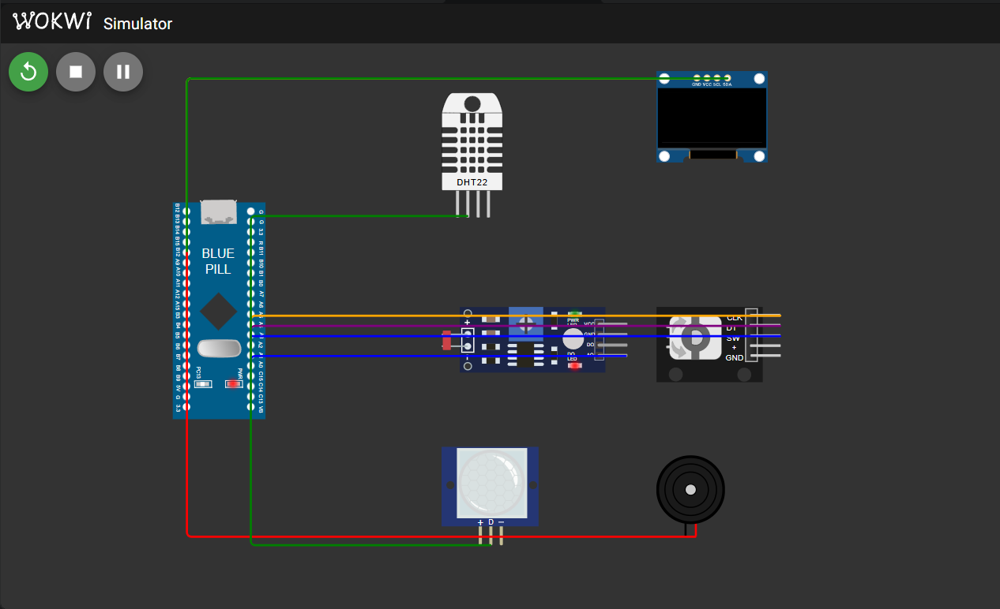
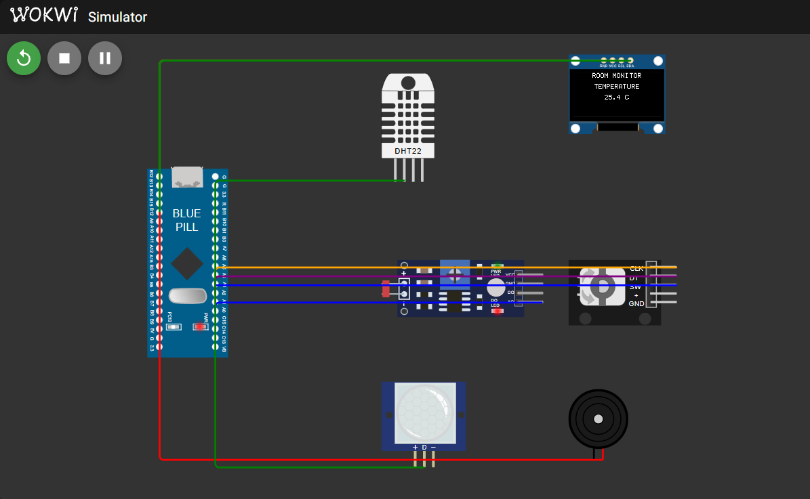

# FreeRTOS Multisensor Room Monitoring System using STM32 Blue Pill

## Project Overview

This project is a real-time room monitoring system built using the STM32F103C8T6 Blue Pill and FreeRTOS.

The system monitors temperature, humidity, ambient light, and motion using a DHT22, an LDR, and a PIR sensor. The current sensor information is shown on an SSD1306 OLED display, while a rotary encoder is used to move between the Temperature, Humidity, Light, and Motion pages.

A buzzer provides a temperature alarm when the measured temperature goes below 18 °C or above 30 °C.

The system also has ACTIVE and INACTIVE operating states. If no motion is detected for 15 seconds, the system becomes INACTIVE and blanks the OLED. When motion is detected again, it automatically returns to ACTIVE mode.

The firmware is organized as a concurrent FreeRTOS application using five tasks, queues, task notifications, a recursive mutex, and periodic task scheduling.

The complete system was developed using PlatformIO with the STM32Cube framework and tested in Wokwi.

---

## Motivation

The main goal of this project was to understand how a small embedded system can be designed using a real-time operating system instead of placing all application behavior inside one continuous loop.

I wanted each part of the room monitor to have a clear responsibility. Sensor acquisition, display control, rotary-encoder input, alarm handling, and motion detection are therefore handled by separate FreeRTOS tasks.

This design also gave me a practical way to work with task priorities, blocking behavior, queues, mutexes, task notifications, state machines, unit testing, and static code analysis in one complete STM32 project.

---

## Features

The system includes the following features:

- DHT22 temperature and humidity monitoring
- LDR ambient-light monitoring
- PIR motion detection
- SSD1306 OLED display
- Four display pages: Temperature, Humidity, Light, and Motion
- Rotary encoder navigation
- High- and low-temperature alarm
- PWM buzzer output
- ACTIVE and INACTIVE operating states
- Automatic OLED blanking after 15 seconds without motion
- Automatic reactivation when PIR motion is detected
- Five FreeRTOS application tasks
- Queue-based data communication
- FreeRTOS task notifications
- Recursive mutex protection for UART logging
- Native unit testing
- Static code analysis
- Wokwi functional verification

---

## Components

The simulated system uses the following components:

| Component | Purpose |
|---|---|
| STM32F103C8T6 Blue Pill | Main microcontroller |
| DHT22 | Temperature and humidity sensing |
| LDR / Photoresistor | Relative ambient-light sensing |
| SSD1306 OLED | Displays the selected measurement |
| Rotary Encoder | Changes the active display page |
| PIR Sensor | Detects motion |
| Buzzer | Temperature alarm output |
| UART1 | Serial monitoring and debugging |

### Pin Connections

| Device / Signal | STM32 Pin |
|---|---|
| DHT22 Data | PB0 |
| LDR ADC | PA0 |
| OLED SCL | PB6 |
| OLED SDA | PB7 |
| Encoder CLK | PA1 |
| Encoder DT | PA2 |
| Encoder SW | PA3 |
| Buzzer PWM | PA8 |
| PIR OUT | PB1 |
| UART1 TX | PA9 |
| UART1 RX | PA10 |

The SSD1306 OLED uses I2C1 with address `0x3C`.

---

## Circuit

The complete project was simulated in Wokwi using the STM32 Blue Pill together with the DHT22, LDR, OLED, rotary encoder, PIR sensor, and buzzer.

The circuit was first verified component by component before the full FreeRTOS application was tested.



**Wokwi circuit for the STM32 FreeRTOS multisensor room monitoring system.**


---

## System Architecture

The system is organized so that each major function has a separate responsibility.

```text
 DHT22                LDR
   |                   |
   +-------+-----------+
           |
      SensorTask
        /     \
       /       \
      v         v
 Display Queue  Alarm Queue
      |             |
      v             v
 DisplayTask     AlarmTask ------> Buzzer
      |
      v
     OLED


 Rotary Encoder ----> InputTask ----> Display Mode Queue
                                      |
                                      v
                                  DisplayTask


 PIR Sensor -------> MotionTask
                         |
                         v
                  ACTIVE / INACTIVE
                         |
                  Task Notification
                         |
                         v
                    DisplayTask
```

Sensor data is produced by `SensorTask` and sent to the display and alarm logic using separate queues.

The rotary encoder is handled by `InputTask`, while motion and activity-state changes are handled by `MotionTask`.

`DisplayTask` owns the OLED, and `AlarmTask` controls the buzzer.

---

## FreeRTOS Architecture

The final application uses five FreeRTOS tasks.

| Task | Priority | Main Responsibility |
|---|---:|---|
| `SensorTask` | 2 | Read temperature, humidity, light, and motion status |
| `DisplayTask` | 1 | Update the OLED |
| `InputTask` | 3 | Process rotary encoder input |
| `AlarmTask` | 2 | Evaluate temperature and control the buzzer |
| `MotionTask` | 3 | Detect motion and manage ACTIVE/INACTIVE state |

The task priorities were chosen based on response time.

`InputTask` and `MotionTask` use priority 3 because user input and motion changes should respond quickly.

`SensorTask` and `AlarmTask` use priority 2 because they are important but less time-sensitive.

`DisplayTask` uses priority 1 because OLED updates can tolerate more delay.

The higher-priority tasks still block regularly using `vTaskDelay()` or `vTaskDelayUntil()`. This prevents them from continuously occupying the CPU and starving lower-priority tasks.

### Inter-Task Communication

The application uses:

- `displaySensorQueue` for sensor data sent to `DisplayTask`
- `alarmSensorQueue` for sensor data sent to `AlarmTask`
- `displayModeQueue` for the selected OLED page
- task notifications for ACTIVE, INACTIVE, MOTION, and ALARM events
- `serialMutex` to protect UART logging

Two separate sensor queues are used because `DisplayTask` and `AlarmTask` both need the latest sensor reading. This prevents the two tasks from competing for the same queue item.

---

## How It Works

When the system starts, the STM32 initializes the sensors, OLED, rotary encoder, buzzer, PIR sensor, UART, FreeRTOS communication objects, and the five application tasks.

`SensorTask` runs periodically and reads the DHT22 and LDR. The latest sensor values are sent to `DisplayTask` and `AlarmTask`.

`DisplayTask` receives sensor data and displays the currently selected page on the OLED.

`InputTask` processes rotary encoder movement. Clockwise rotation moves to the next display page, while counterclockwise rotation moves to the previous page.

The available pages are:

```text
TEMPERATURE
HUMIDITY
LIGHT
MOTION
```

`AlarmTask` checks the temperature.

- Below 18 °C: LOW temperature alarm
- 18 °C to 30 °C: NORMAL
- Above 30 °C: HIGH temperature alarm

The buzzer is activated whenever the temperature is outside the normal range.

`MotionTask` checks the PIR sensor every 100 ms. The system begins in ACTIVE mode. If no motion is detected for 15 seconds, the system becomes INACTIVE and the OLED is blanked.

While INACTIVE, sensor and alarm processing continue, but rotary encoder navigation is ignored.

When the PIR sensor detects motion again, the system returns to ACTIVE mode and the OLED is restored.

---

## Testing and Verification

The project was tested at several levels instead of relying only on the final Wokwi simulation.

### Unit Testing

Hardware-independent logic was tested using PlatformIO's native environment and the Unity test framework.

A total of 13 unit tests were created.

#### Temperature Alarm — 5 Tests

The alarm tests checked:

- temperature below 18 °C
- exactly 18 °C
- a value inside the normal range
- exactly 30 °C
- temperature above 30 °C

#### Display Navigation — 4 Tests

The navigation tests checked:

- clockwise page change
- clockwise wraparound
- counterclockwise page change
- counterclockwise wraparound

#### System State — 4 Tests

The state tests checked:

- ACTIVE before the timeout
- INACTIVE exactly at the timeout
- INACTIVE after the timeout
- motion returning the system to ACTIVE

The final native test result was:

```text
13 test cases: 13 succeeded
```

---

### Functional Verification in Wokwi

The complete system was also tested using ten functional tests in Wokwi.

| Test | Stimulus | Observed Result |
|---|---|---|
| FT-01 | Temperature changed to 27.3 °C | OLED and Serial updated to 27.3 °C |
| FT-02 | Humidity changed to 77.0% | OLED updated to 77.0% |
| FT-03 | LDR illumination changed | Relative light value changed to 10% |
| FT-04 | Encoder rotated clockwise from LIGHT | Display changed to MOTION |
| FT-05 | Encoder rotated counterclockwise from MOTION | Display changed to LIGHT |
| FT-06 | Temperature changed to 35.8 °C | HIGH alarm reported and buzzer turned on |
| FT-07 | Temperature returned to 23.9 °C | Alarm returned to NORMAL and buzzer stopped |
| FT-08 | PIR triggered while ACTIVE | Motion was detected |
| FT-09 | No motion for 15 seconds | System became INACTIVE and OLED blanked |
| FT-10 | PIR triggered while INACTIVE | System returned to ACTIVE and OLED was restored |

All ten functional tests passed.

---

### Static Code Analysis

Static code analysis was performed using PlatformIO Check and Cppcheck.

The final result was:

| Severity | Findings |
|---|---:|
| HIGH | 0 |
| MEDIUM | 0 |
| LOW | 102 |

Both PlatformIO environments passed the analysis.

Most of the LOW findings were style-related, including C-style casts and functions that Cppcheck could not identify as being used indirectly through callbacks or interrupt handlers.

I reviewed these findings but did not change stable embedded code only to remove low-severity style warnings.

---

## Deliberate FreeRTOS Fault Experiments

I also introduced three temporary faults to observe how incorrect RTOS design affects the system.

### Removing Task Blocking

The delay at the end of `InputTask` was temporarily removed.

The task then executed continuously and repeatedly printed:

```text
InputTask -> encoder button pressed
```

The Serial Monitor became flooded and the normal output of lower-priority tasks was no longer observed during the test.

This showed how a high-priority task that never blocks can consume CPU time and starve lower-priority tasks.

### Increasing the Priority of InputTask

`InputTask` was temporarily changed from priority 3 to priority 4.

The system continued to operate normally because `InputTask` still called `vTaskDelay()` and regularly entered the Blocked state.

This showed that task priority and blocking behavior must be considered together.

### Removing UART Mutex Protection

Mutex protection was temporarily removed from the UART logging function.

No obvious interleaved output appeared during the observed test, but UART access was no longer synchronized.

The mutex was restored because the UART remains a shared resource and different timing conditions could still produce a race condition.

---

## Demonstration

The final Wokwi simulation demonstrates the complete room-monitoring system running in ACTIVE mode.



**Final Wokwi simulation with live sensor information displayed on the SSD1306 OLED.**

During the demonstration, the DHT22 values, LDR input, rotary encoder, PIR sensor, OLED, and buzzer can all be changed or observed directly in Wokwi.

The system can also be left without motion for 15 seconds to demonstrate the transition from ACTIVE to INACTIVE mode.

---

## Challenges Encountered

One of the biggest challenges was running FreeRTOS reliably in the Wokwi STM32F103 environment.

The final project uses a Wokwi-compatible FreeRTOS port with TIM3 providing the 20 Hz RTOS tick. The compatibility port uses direct thread-mode task switching instead of relying on the usual SVC/PendSV path that caused problems during simulation.

Another challenge was understanding how task priorities interact with blocking behavior.

The fault experiment with `InputTask` showed that a high-priority task can interfere with the rest of the application if it continuously runs without blocking.

The OLED also required a Wokwi-specific APB1/I2C clock adjustment before communication became reliable.

These problems made debugging slower, but they also helped me understand the interaction between the RTOS, STM32 peripherals, and the simulator.

---

## Lessons Learned

This project helped me understand that using FreeRTOS is more than simply creating several tasks.

A task should have a clear responsibility, a justified priority, and an appropriate blocking condition.

I also learned that queues are useful for passing data safely between tasks, while task notifications work well for lightweight events.

The UART mutex showed why shared hardware resources need synchronization even when a race condition is not immediately visible.

Separating decision logic from hardware code also made unit testing much easier. Alarm evaluation, display navigation, and activity-state logic could be tested without requiring the STM32 or Wokwi.

The deliberate fault experiments were especially useful because they showed what happens when correct RTOS design rules are temporarily removed.

---

## Limitations

The current project still has several limitations:

- most testing was performed in Wokwi instead of on physical STM32 hardware
- the LDR reading is a relative percentage rather than calibrated lux
- the temperature alarm thresholds are fixed in firmware
- the 15-second inactivity timeout is fixed in firmware
- sensor history is not stored
- the project does not include Wi-Fi or Bluetooth communication
- heavy UART logging may influence timing
- physical hardware may introduce noise, wiring issues, and sensor tolerances that are not present in simulation

---

## Future Improvements

Possible improvements for a future version include:

- testing the complete project on a physical STM32 Blue Pill
- calibrating the ambient-light measurement
- allowing adjustable temperature thresholds
- allowing a configurable inactivity timeout
- storing sensor history
- adding Wi-Fi or Bluetooth communication
- creating a remote monitoring interface
- improving the OLED display layout
- storing configuration settings in flash memory
- adding watchdog monitoring
- adding FreeRTOS runtime statistics

---

## GitHub Repository

The complete source code, FreeRTOS configuration, Wokwi circuit, unit tests, verification records, and laboratory report are available in the project repository:

https://github.com/ShaniceReih/bca182-freertos-multisensor

The repository also contains the incremental Git history used throughout development.

---

## References

The following documentation and tools were used during development:

- BCA182 Embedded Systems Programming — Laboratory Activity No. 1
- FreeRTOS documentation
- STM32Cube HAL documentation
- PlatformIO documentation
- Wokwi documentation
- Unity Test Framework
- Cppcheck
- Git and GitHub